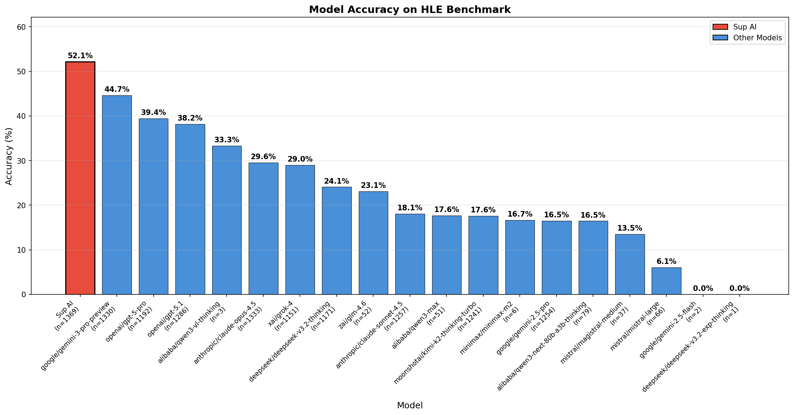

# Sup AI Achieves 52.15% on Humanity's Last Exam

**The new leader on the world's most challenging AI benchmark**



## Summary

[Sup AI](https://sup.ai) has achieved **52.15% accuracy** on [Humanity's Last Exam (HLE)](https://lastexam.ai/), surpassing all individual frontier models and setting a new state-of-the-art on this exceptionally challenging benchmark. This result demonstrates that multi-model orchestration can unlock capabilities beyond what any single model achieves alone.

| Metric | Value |
|--------|-------|
| **Accuracy** | 52.15% |
| **Questions Evaluated** | 1,369 / 2,500 public |
| **Lead Over Next Best** | +7.49 percentage points |
| **Calibration Error (ECE)** | 35.22% |

## What is Humanity's Last Exam?

Humanity's Last Exam (HLE) is a benchmark designed to be the ultimate test of AI reasoning capabilities. Created through a collaborative effort, HLE contains 2,500 public questions spanning advanced mathematics, science, logic, and interdisciplinary reasoning. These are problems curated to challenge even the most sophisticated AI systems.

Unlike conventional benchmarks that have become saturated, HLE was specifically designed to remain difficult as AI capabilities advance. A score of 52% represents a significant milestone in AI development.

## Results Comparison

Sup AI's multi-model approach significantly outperforms all individual frontier models:

| Model | Accuracy | n | Δ vs Sup AI |
|-------|----------|---|-------------|
| **Sup AI** | **52.15%** | 1,369 | — |
| Google Gemini 3 Pro Preview | 44.66% | 1,330 | -7.49 |
| OpenAI GPT-5 Pro | 39.43% | 1,192 | -12.72 |
| OpenAI GPT-5.1 | 38.18% | 1,286 | -13.97 |
| Anthropic Claude Opus 4.5 | 29.56% | 1,333 | -22.59 |
| xAI Grok-4 | 29.02% | 1,151 | -23.13 |
| DeepSeek v3.2 Thinking | 24.08% | 1,171 | -28.07 |
| ZhipuAI GLM-4.6 | 23.08% | 52 | -29.07 |
| Anthropic Claude Sonnet 4.5 | 18.06% | 1,257 | -34.09 |
| Alibaba Qwen3 Max | 17.65% | 51 | -34.50 |
| Moonshot Kimi K2 Thinking | 17.57% | 1,241 | -34.58 |
| Google Gemini 2.5 Pro | 16.51% | 1,254 | -35.64 |

## How Sup AI Works

Sup AI orchestrates multiple frontier models that are best suited for the prompt, aggregating their responses to produce higher-quality answers than any individual model. We use logprob analysis on each individual response and each "chunk" of each response in order to determine how confident the model is.

We only include high-confidence portions of each response in the consensus. If there are significant disagreements within models, we will retry. If the confidence is too low, we will retry. We will also weight responses that align with a model's specialty as most likely more accurate.

Not all of the models Sup AI uses are multimodal, while some HLE questions involve images. Sup AI allows you to pass PDFs and images to models that don't natively support them by pre-processing the files.

Sup AI achieves emergent capabilities that exceed the sum of its parts.

## Methodology

### Evaluation Protocol

1. **Question Selection**: Questions were chosen at random from the 2,500 public HLE questions
2. **Question Processing**: Each HLE question (text and optional image) is submitted to the Sup AI API
3. **Response Format**: Models respond with structured output containing explanation, answer, and confidence score
4. **Automated Judging**: Responses are evaluated using GPT-5.1 with structured output parsing (100% reliability via Pydantic strict mode)
5. **Metrics Calculation**: Accuracy, variance (Wald estimator), and Expected Calibration Error (ECE) are computed

The responses are generated **exactly** as if you pasted the question into Sup AI's chat interface at <https://sup.ai>. There is no custom prompting for benchmarks. Even the system prompt is inserted in place of the user instructions, which any user can edit.

**Web Search**: Models have access to web search during evaluation. However, answers cannot be obtained through web search. On a couple of instances, models attempted to find answers online, but we verified they were unsuccessful.

### Prompt Format

```
System: Your response should be in the following format:
Explanation: {your explanation for your answer choice}
Answer: {your chosen answer}
Confidence: {your confidence score between 0% and 100% for your answer}

User: [Question text + optional image]
```

### Judge Criteria

The automated judge uses GPT-5.1 to extract the final answer and compare it against the ground truth, accounting for:
- Exact matches
- Semantic equivalence
- Numerical tolerance for quantitative answers

The judging methodology was adapted from the [official HLE repository](https://github.com/centerforaisafety/hle).

## Reproducing Results

### Prerequisites

```bash
python3.13 -m venv .venv
source .venv/bin/activate
pip3.13 install -r requirements.txt
```

Required environment variables:
- `SUPAI_API_KEY`: Your Sup AI API key (not publicly available yet, coming very soon)
- `OPENAI_API_KEY`: OpenAI API key (for judging)

### Run Evaluation

```bash
# Generate predictions using Sup AI
python src/run_model.py \
    --dataset cais/hle \
    --model pro \
    --num_workers 10

# Judge responses against ground truth
python src/run_judge.py \
    --dataset cais/hle \
    --predictions hle_pro.json \
    --num_workers 10

# Generate metrics and visualization
python src/run_metrics.py --predictions judged_hle_pro.json
```

## Statistical Significance

With n=1,369 questions, the 95% confidence interval for Sup AI's accuracy is approximately ±2.65 percentage points, meaning the true accuracy lies between 49.50% and 54.80% with 95% confidence.

The gap between Sup AI (52.15%) and the next-best model, Gemini 3 Pro Preview (44.66%), is statistically significant at p < 0.001.

> Why did Gemini 3 Pro Preview get a higher HLE score than published?

- Custom instructions
- Agentic loop
- Web search
- Retrying when confidence score (calculated with logprobs) is too low

This will cause **all** models to get higher-than-published results. However, relative scores are about the same as published results, and most notably we are significantly better in terms of relative score (and raw score).

## Implications

This result demonstrates several important findings:

1. **Multi-model systems exceed individual model capabilities**: The ensemble approach achieves accuracy 7+ percentage points higher than the best single model.

2. **Complementary model strengths**: Different models excel at different problem types; orchestration captures these diverse capabilities.

3. **Benchmark validity**: Despite exceeding 50% accuracy, significant headroom remains—indicating HLE continues to effectively measure frontier AI capabilities.

4. **Practical accessibility**: These capabilities are available today through Sup AI, enabling applications requiring state-of-the-art reasoning.

## Accuracy for each question

See [questions.md](/questions.md)

## Files

| File | Description |
|------|-------------|
| `src/run_model.py` | Generates predictions using Sup AI API |
| `src/run_judge.py` | Evaluates predictions against ground truth |
| `src/run_metrics.py` | Computes metrics and generates visualizations |
| `hle_pro.json` | Raw model predictions |
| `judged_hle_pro.json` | Predictions with judge evaluations |
| `metrics.json` | Computed accuracy metrics by model |
| `metrics.png` | Accuracy comparison bar chart |
| `questions.md` | Per-question correctness table for each model |
| `traces/` | Full response traces for each question, exactly as it would be streamed from the Sup AI API |

## Citation

If you use these results or methodology, please cite:

```
@misc{supai-hle-2025,
  title={Sup AI Achieves 52.15% on Humanity's Last Exam},
  author={Sup AI},
  year={2025},
  url={https://github.com/supr-ai/hle}
}
```

## License

This evaluation code is provided for research and reproducibility purposes.

---

**Try Sup AI**: [sup.ai](https://sup.ai) | **HLE Benchmark**: [lastexam.ai](https://lastexam.ai) | **Leaderboard**: [scale.com](https://scale.com/leaderboard/humanitys_last_exam)
